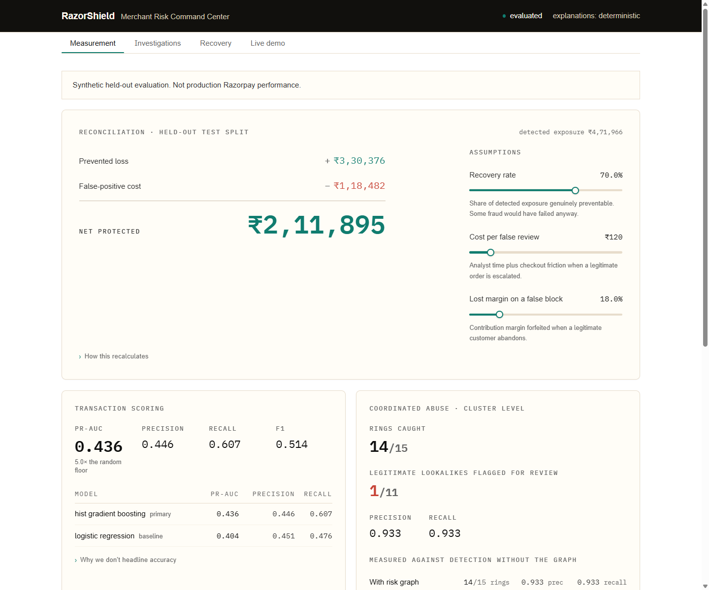
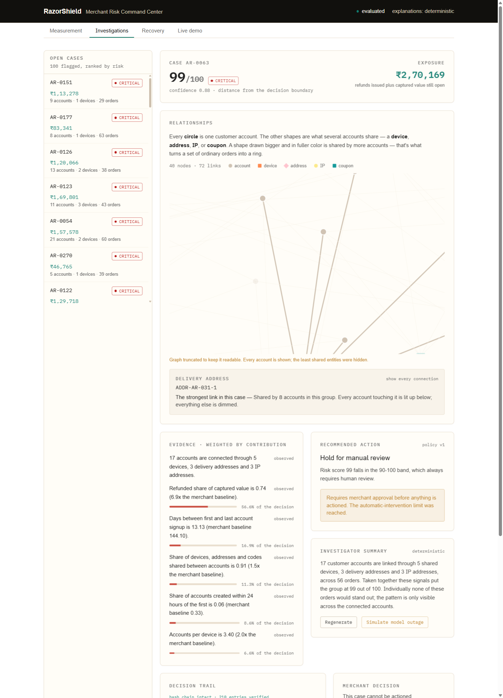
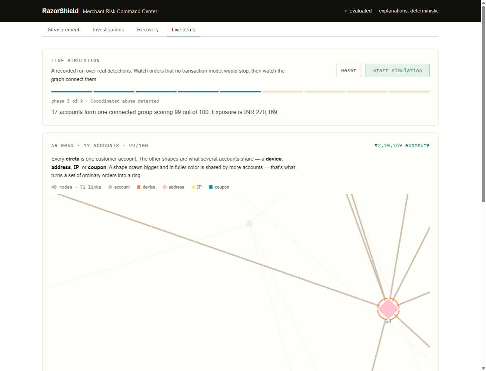
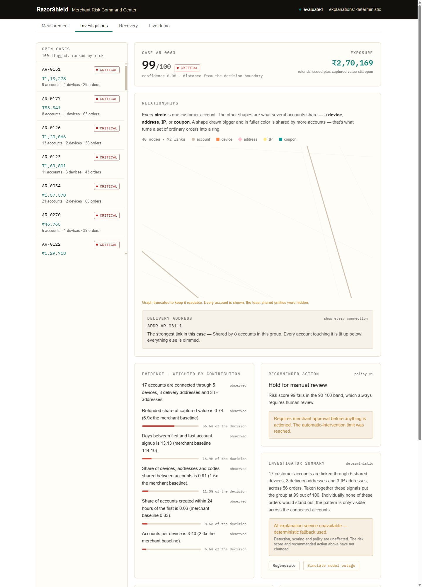
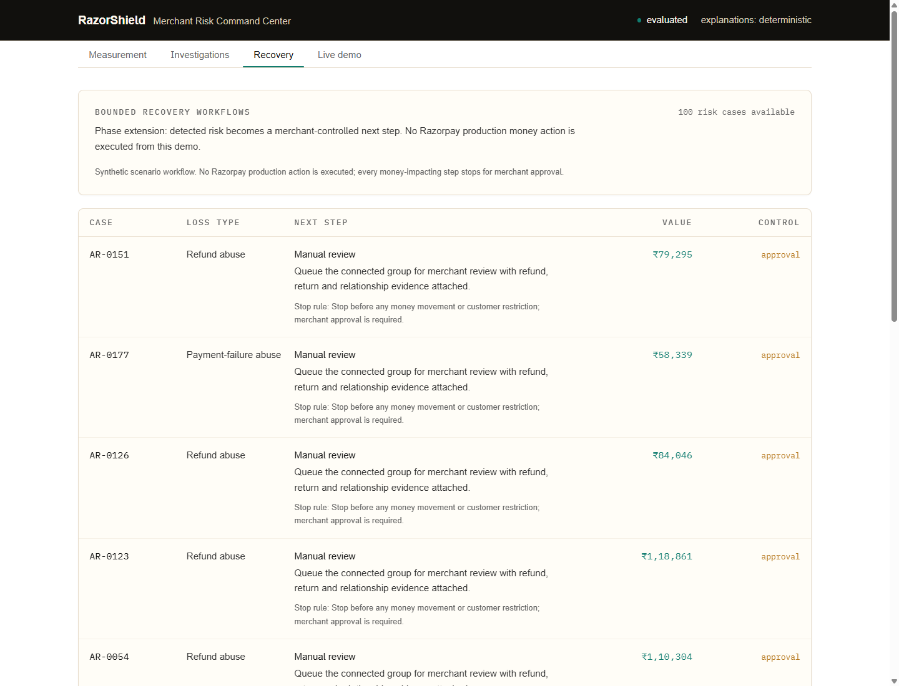

# RazorShield

**AI Merchant Risk Intelligence** — Razorpay AI Buildathon, Track 02: AI Risk Manager

Individual transactions can look legitimate. RazorShield detects the coordinated
network behind them — across accounts, devices, IPs, addresses, coupons, and
refunds — and reports exactly how much money that detection protects.

> **Build status: complete — 16 of 16 phases.** The API contract is frozen, and the dataset
> generator produces 19,319 transactions from seed 42 with 95 abuse rings and
> 112 legitimate lookalike clusters. Models are trained and evaluated on a
> held-out split; `make reproduce` regenerates every number below from seed 42.
> The API serves `artifacts/metrics.json` verbatim, and a test asserts it does
> not alter the numbers in transit.

---

## Why this is different

Most fraud tooling scores rows. A row-level model sees a ₹4,999 electronics
order from a two-week-old account and shrugs — it's unremarkable on its own.

RazorShield scores the *structure*: seventeen accounts sharing four devices and
three delivery addresses, created within a short interval, redeeming the same
coupon, refunding at several times the merchant's baseline. None of those
transactions is individually alarming. Together they're a ring.

Two design commitments make the claim defensible rather than decorative:

**Hard negatives.** The synthetic generator injects legitimate clusters that
structurally resemble rings — a family sharing one address, an office IP with
thirty accounts, a hostel, a high-return reseller, a real flash-sale spike.
Detecting injected rings is easy. Separating them from lookalikes is the
actual problem, and it's the number we report.

**Deterministic decisions.** The LLM never decides whether a transaction is
fraudulent. It explains structured evidence our models produced, and its output
is gated by a policy engine it cannot override. If the LLM is unavailable, the
system degrades to templated explanations and keeps working.

---

## Architecture

Heavy computation runs offline and writes artifacts. The API is a thin read
layer. Nothing trains, fits, or runs graph algorithms during a demo.

```
Offline:  generate -> features (point-in-time) -> train -> evaluate
                   -> graph build -> ring detection
                                  |
                                  v
                          artifacts/*.json,*.pkl
                                  |
                                  v
Online:   FastAPI (score, fuse, apply policy, audit)  --optional-->  LLM investigator
                                  |                                   (falls back)
                                  v
                          React dashboard
```

### Extension phases

RazorShield is submitted for **Track 02 — AI Risk Manager**. The product is
structured so adjacent merchant-loss workflows can be added without weakening
that core claim:

| Phase | Scope | Status |
|---|---|---|
| 1 | Detect coordinated refund, return and promo abuse rings | Built |
| 2 | Explain evidence and apply bounded merchant-controlled policy | Built |
| 3 | Show financial impact with false-positive cost and adjustable assumptions | Built |
| 4 | Convert detected risk into bounded recovery workflows | Prototype built |
| 5 | Execute real recovery actions on Razorpay test-mode APIs | Future work |
| 6 | Reconcile settlements, refunds and exceptions across finance records | Future work |

The current recovery workflow extension recommends review, verification,
evidence preparation or monitoring from existing risk artifacts. It does **not**
execute production money movement, retry payments, or fabricate recovered
revenue.

---

## Methodology commitments

These are stated up front because they're the questions a judge should ask.

| Concern | Commitment |
|---|---|
| Data leakage | Every feature is computed as-of the row's own timestamp. Enforced by a test, not a convention. |
| Temporal honesty | Graph and ring detection run retrospectively over a trailing window, matching how batch ring detection works in production. They are not in the online scoring path. |
| Split | Time-aware 70/15/15. The test split is never touched during training. |
| Primary metric | Net protected value in ₹, not accuracy. Accuracy is displayed but never headlined — the classes are imbalanced. |
| Two evaluations | Transaction-level and ring-level metrics are reported separately and never merged. They measure different problems. |
| Synthetic data | Metrics measure recovery of injected patterns under documented generative assumptions. This is stated on the dashboard, not buried here. |
| Financial claims | Prevented loss applies a documented recovery rate (default 0.70). We do not claim 100% of detected exposure was preventable. All assumptions are adjustable in the UI. |

---

## Dataset

Generated from seed 42. `make generate` reproduces it exactly.

| | |
|---|---|
| Transactions | 19,319 over 120 days |
| Customers | 4,234 |
| Fraud rate | 8.97% (transactions belonging to coordinated abuse) |
| Abuse rings | 95, across 5 distinct signatures |
| Legitimate lookalike clusters | 112, across 5 profiles |
| Returns / refunds | 1,881 / 3,125 |

**Ring signatures:** refund ring, coupon ring, return-fraud ring, card testing,
promo farm. Ring members also place ordinary orders, which are labelled 0, so
the row-level problem is realistically hard rather than trivially separable.

**Legitimate lookalikes (hard negatives):** shared-address family, office
network, hostel cluster, power reseller, flash-sale cohort. These exist because
detecting an injected ring is easy; not accusing a family is the actual problem.

### The hard-negative overlap gate

`make overlap` measures, for each cluster-level structural feature, how well
that feature *alone* separates abuse rings from legitimate lookalikes. If any
single feature gave the answer away, every downstream metric would be theatre.

| Feature | Separating power | Ring p10–p90 | Lookalike p10–p90 |
|---|---|---|---|
| accounts per device | 0.66 | 2.0 – 7.0 | 1.2 – 3.9 |
| refund value ratio | 0.61 | 0.04 – 0.74 | 0.01 – 0.37 |
| signup span (days) | 0.47 | 1.2 – 14.9 | 0.4 – 426.9 |
| failed payment rate | 0.30 | 0.02 – 0.64 | 0.00 – 0.16 |
| return rate | 0.29 | 0.00 – 0.62 | 0.00 – 0.36 |
| accounts per address | 0.23 | 2.5 – 9.0 | 1.5 – 9.0 |
| transaction velocity | 0.18 | 0.25 – 4.15 | 0.18 – 1.85 |
| accounts per IP | 0.08 | 2.6 – 13.0 | 1.6 – 19.0 |
| account count | 0.06 | 5 – 21 | 3 – 40 |
| coupon reuse | 0.03 | 0.02 – 0.92 | 0.03 – 0.88 |

No feature exceeds 0.66. Eight of ten carry essentially no standalone signal:
account count, accounts-per-IP, and coupon reuse are *worthless* on their own,
because an office network has more accounts on one IP than any ring, and a
bargain-hunting hostel reuses coupons as heavily as a promo farm.

That is the point. Separation has to come from combinations, which is exactly
what RazorShield claims to do. This check runs as a test and fails the build if
the dataset ever drifts toward being too easy.

### Split

Time-aware, cut at the 70% and 85% points by transaction order. A cluster is
assigned to whichever split holds the majority of its transactions; clusters
straddling a boundary are excluded from ring-level evaluation rather than
counted twice.

| Split | Rows | Positive rate | Evaluable rings | Evaluable lookalikes |
|---|---|---|---|---|
| train | 13,523 | 0.094 | 69 | 68 |
| validation | 2,898 | 0.071 | 2 | 8 |
| test (held out) | 2,898 | 0.087 | 15 | 11 |

The held-out split carries 15 rings and 11 legitimate lookalikes — enough for a
ring-level confusion matrix that means something. Known limitation: validation
holds only 2 evaluable rings, so ring-level threshold tuning has thin support
and is done at transaction level instead.

### Leakage barrier

Events and labels are written to physically separate directories. The feature
builder is only ever pointed at `data/events/`; `data/labels/` holds
`is_fraud` and `cluster_id` and is never opened by the feature pipeline. A test
asserts no label column is reachable from the event log.

---

## Features

38 features, built by `make features`. Every one is computed from events
strictly before the transaction's own timestamp.

| Group | Examples |
|---|---|
| Amount | log amount, deviation from the customer's own prior mean, z-score, deviation from category prior mean |
| Tenure and cadence | account age, prior transaction count, purchase frequency, gap since previous order, orders in trailing 24h / 7d |
| Payment reliability | prior failure rate, failures in trailing 24h |
| Prior returns and refunds | prior return count and rate, prior refund count and rate, prior refund-to-order value ratio |
| Entity sharing | distinct customers per device / IP / address so far, transactions per entity, device activity in 24h, address activity in 7d |
| Coupons | coupon present, uses so far, distinct customers on that code |
| Timing | hour, night flag, day of week, payment method |
| Merchant backdrop | transactions merchant-wide in the trailing hour |

### Point-in-time correctness

Two mistakes here would quietly inflate every number downstream, so both are
handled explicitly.

**Late-arriving events.** A refund attached to an old order happens *after*
that order. Prior-refund features are keyed on the refund's own timestamp, not
the transaction's, so a refund that has not happened yet is never counted.

**Fill values.** A missing prior statistic is filled with a fixed constant,
never a global mean. Filling row one with a dataset-wide average would leak the
entire dataset into the first prediction.

The guarantee is enforced rather than asserted. For sampled rows, the test
suite rebuilds the event log truncated at that row's own timestamp, recomputes
the full feature vector, and demands an exact match to nine decimal places. If
any feature reaches forward by a single event, the values diverge and the build
fails.

`make verify` runs a 12-row version of the same probe.

### Signal check

Strongest standalone feature: `account_age_days`, separating power 0.743
(inverted — young accounts skew fraudulent). Seventeen of the 38 features carry
almost no standalone signal.

Nothing approaches a label proxy, which is the outcome we want. If a single
feature scored above 0.95 the label would almost certainly have been written
into it, and the test suite fails on exactly that condition.

---

## Held-out results

Test split scored once, with the threshold already fixed on validation.
`make evaluate` reproduces this.

### Transaction level

| Model | PR-AUC | Precision | Recall | F1 |
|---|---|---|---|---|
| Gradient boosting (primary) | **0.436** | 0.446 | 0.607 | 0.514 |
| Logistic regression (baseline) | 0.404 | 0.451 | 0.476 | 0.463 |

Random-guess PR-AUC on this split is 0.087, the positive rate — so the primary
model is a 5× lift. Confusion matrix: 153 TP, 190 FP, 99 FN, 2,456 TN.

Gradient boosting buys about 8% PR-AUC over logistic regression. That is a real
but modest gain, and it is reported rather than hidden, because a project that
only shows its strongest model has not demonstrated that the complexity earned
anything.

**Accuracy is 0.900 and we do not headline it.** At an 8.7% positive rate, a
model that flags nothing at all scores 0.913. By accuracy, doing nothing beats
our model. That is exactly why accuracy is displayed but never treated as the
business metric.

### Ring level — does the graph earn its place?

Both detectors scored on **the same 15 rings and 11 legitimate lookalikes**,
through the same function, with the same credit rule. Comparing detectors on
different denominators would make the comparison meaningless, so they share one
scorer.

| | Rings caught | Wrongly accused | Precision | Recall |
|---|---|---|---|---|
| **With risk graph** | **14 / 15** | 1 / 11 | 0.933 | **0.933** |
| Shared device only | 9 / 15 | 0 / 11 | 1.000 | 0.600 |

**The graph is worth 5 additional rings caught, at the cost of one additional
false accusation.**

That is the whole argument of the product, measured rather than asserted. The
floor is not a strawman: it groups accounts sharing a device and scores each
group by mean transaction risk, and because the row model already sees one-hop
entity counts, it starts with graph-flavoured signal already baked in. The
graph still beats it by 56% relative recall.

The trade is stated honestly. Perfect precision at 0.600 recall means six rings
walk away. If a merchant prefers that, the threshold is a single number.

### Financial impact

| | |
|---|---|
| Detected exposure | ₹471,966 |
| Prevented loss (70% recovery) | ₹330,376 |
| False-positive cost | ₹118,482 |
| **Net protected value** | **₹211,894** |

Assumptions: 70% recovery rate, ₹120 per false manual review, 18% lost margin on
a false block. All three are exposed as adjustable inputs on the dashboard, so a
judge who disagrees with a default can change it and watch the number move.

### Leakage alarm

`ml/train.py` raises if held-out PR-AUC exceeds 0.99, and a test asserts the
same. On synthetic data a near-perfect score means the label leaked into a
feature. The build fails rather than reporting it.

---

## Dashboard

Dark ink console, no gradients. Every figure is set in IBM Plex Mono with
tabular numerals, because the product is a measuring instrument and should read
like one. Money uses Indian digit grouping.

**The hero is a reconciliation ledger, not a row of KPI cards.** Most fraud
dashboards show one large saved-money figure. RazorShield shows the subtraction:

```
Prevented loss              + ₹3,30,376
False-positive cost         − ₹1,18,482
─────────────────────────────────────────
NET PROTECTED                 ₹2,11,894
```

Showing what our own false alarms cost the merchant is the argument of the
product, so it gets the top of the page. The assumptions behind each line sit
directly beneath the arithmetic rather than in a footnote.

Below it: transaction scoring with the logistic baseline shown alongside the
primary model; cluster-level detection where *legitimate clusters wrongly
accused* is set in the same size as rings caught; the outcome matrix; the split
table; and a numbered list of how to read the numbers, served from the API's own
caveats rather than written into the page.

Accuracy appears exactly once, next to the score a do-nothing model would get,
so a reader can see for themselves why it is not the headline.

### Two contracts, checked from both sides

`tests/test_contract.py` proves the API matches the frozen schema.
`frontend/scripts/check-api-shape.mjs` proves the dashboard only reads fields
that actually arrive. Together, a field cannot be renamed on one side and
silently break the other. Both run in `make verify`.

---

## Merchant risk graph

`make graph`. Customers are linked to the entities they share — devices, IPs,
shipping addresses, coupon codes — so coordinated behaviour becomes a connected
component instead of a set of unremarkable rows.

**11,448 nodes, 14,977 edges, 297 components with three or more accounts.**

### Hub suppression

The central engineering problem is that hub entities collapse the graph. A
public coupon used by four hundred customers is not evidence those people know
each other, and neither is a carrier-grade NAT address. Link through them and
the entire merchant becomes one component.

RazorShield suppresses entities above an explicit per-type degree threshold, and
counts what it suppressed rather than dropping edges silently:

| Entity | Threshold | Suppressed |
|---|---|---|
| device | 25 accounts | 0 of 3,238 |
| IP | 40 accounts | 0 of 1,562 |
| address | 30 accounts | 0 of 2,338 |
| coupon | 70 accounts | 40 of 116 |

Exactly the 40 public pool codes fall out; every cluster-specific promo code
survives. The thresholds are deliberately generous, because suppressing harder
would fragment the legitimate lookalikes — an office network on one IP, a
flash-sale cohort on one promo code — and make our precision look good by
removing the hard cases rather than confronting them.

A test asserts this choice is load-bearing: with suppression disabled, more than
half the merchant collapses into a single component. With it, the largest
component holds 59 accounts of 4,234.

### Recovery

A detector cannot score a group the graph never formed, so recovery is a hard
ceiling on ring-level recall.

| | Fully recovered | Recovered ≥70% |
|---|---|---|
| Abuse rings (95) | 100% | 100% |
| Legitimate lookalikes (112) | 89% | 90% |

Both matter. Lookalikes must survive as components or they cannot become false
positives, and a graph that quietly fragments the hard cases would be flattering
itself.

The lookalikes that do not form components are single-account power resellers,
which have nothing to connect to. They are structurally incapable of being graph
false positives, and that is stated rather than counted as a win.

### What the graph actually contributes — and what it doesn't

Honest result: **most component features are the same signals measured at
cluster level rather than new ones.** Refund value ratio, accounts per device,
and signup span dominate, exactly as they did in the Phase 2 overlap analysis.

Three topological features were tried. Two failed:

- `shared_entity_ratio` was **1.0 by construction** — a component formed by
  shared entities trivially has every account touching one. A design error,
  removed rather than left in to pad the feature list.
- `component_density` scored 0.005 separating power. Components are star-shaped
  bipartite graphs, so density is a function of size and nothing else.
- `bridging_channels` (how many entity *types* bridge accounts) scored 0.058.
  The hypothesis that rings overlap on more channels than families did not hold.

One worked:

- **`bridging_entity_ratio`** — the share of a component's entities that link
  more than one account — reaches **0.449 separating power (AUC 0.724)**, the
  fourth strongest feature overall. In a ring, most entities are shared: few
  devices, few addresses, many accounts. In an office network, nearly every
  entity is private — each employee's own phone and home address — and only the
  IP bridges. That distinction is a property of the component and cannot be
  expressed by any one-hop count the row model has.

So the graph's contribution is threefold, stated in order of how much it
actually matters: it **constitutes the entity to be judged** (without it there
is no group to score, no exposure to total, and nothing to draw for an
investigator), it **aggregates behaviour** over that entity, and it adds **one**
genuinely structural feature. That is a real contribution and it is smaller than
the pitch a graph feature usually gets.

---

## Ring detection

`make rings`. Components from the graph are scored, ranked, and given structured
evidence.

### Weights are learned, not chosen

A hand-tuned weighted sum is a set of numbers adjusted until the demo looks
good. Instead a logistic regression is fit on components from the training
window, with eight documented features and strong L2 regularisation, because
there are only ~270 components to learn from and a wide model would memorise
them.

| Feature | Coefficient |
|---|---|
| signup span (log days) | **−2.04** |
| refunded share of captured value | +1.81 |
| failed payment rate | +0.96 |
| bridging entity ratio | +0.93 |
| accounts per device | +0.92 |
| signup burst ratio | −0.59 |
| return rate | −0.21 |
| transaction velocity | +0.17 |

The strongest signal is *negative*: a long gap between the first and last
account signup pushes a component toward legitimate. A family accretes accounts
over years; a promo farm registers them in an afternoon. Return rate also lands
negative, which matches the design brief — a high return rate on its own is a
reseller, not a fraudster.

**The threshold is chosen by 5-fold cross-validation inside the fitting pool,
not on the held-out split.** The validation window holds only two ring
components, too thin to tune against, so tuning there would be theatre. The
test window is scored exactly once.

### Evidence comes from the model, not from a story

Each evidence item carries the share of the decision that feature actually
contributed, computed from the standardised feature value times its coefficient.
Items are ordered by that contribution and anything under 4% is dropped.

Evidence that reads plausibly but was assembled after the decision is a story,
not a reason, and a merchant acting on it would be misled. A test asserts the
weights sum to the decision they claim to explain, that they are ordered by
contribution, and that no statement leaks cluster ground truth.

Only signals pushing *toward* risk appear as evidence. Mitigating signals are
reflected in the score itself rather than presented as accusations.

### Exposure

Defined as refunds already issued plus captured value still open to refund or
chargeback. This is an upper bound on what could be lost, not a claim that it
will be; the financial engine applies the recovery rate on top.

### Confidence

Distance from the decision boundary, normalised. A component sitting on the
threshold is reported as low confidence rather than as a coin flip dressed up as
a verdict.

### Contract change

Adding `ring_baseline_model` to `/api/metrics` was a deliberate, additive
amendment (contract v1.1). It is optional, so every existing consumer stays
valid, and it exists so the graph's contribution is attributable rather than
asserted.

---

## Fraud spike detector

`make spikes`. Rolling median and median absolute deviation over prior hourly
windows, then a modified z-score. Interpretable statistics, not ML — an anomaly
alert nobody can verify by hand is an alert nobody should act on.

Median and MAD rather than mean and standard deviation, because one large spike
inflates a mean and its variance together and blinds the detector to the next
one. Baselines exclude the window they judge, so a spike can never contribute to
the statistic meant to detect it. Both are asserted by test.

### The failure this had to solve

A volume detector cannot tell a promo farm from a flash sale. Both are a burst
of fresh accounts redeeming one code in an afternoon, with elevated payment
failure. One is fraud; the other is the merchant's best day of the quarter.

Measured on this dataset, the uncorroborated volume detector raised **1,189
alerts, of which 61 fired on the merchant's own campaigns**, at 1.37× lift over
chance. That detector gets muted in a week, and a muted detector protects
nothing.

### Corroboration

An alert now requires two things: abnormal volume **and** an abnormal share of
high-risk orders in the same window. The separation is stark — 71% of a ring's
orders score high risk, against 3% of a flash-sale cohort's.

| | Alerts | Abuse-driven | On flash sales | Lift | Rings alerting |
|---|---|---|---|---|---|
| Volume alone | 1,189 | 223 | 61 | 1.37× | — |
| **With corroboration** | **78** | **72** | **0** | **3.28×** | 65% |

78 alerts across 120 days is roughly one every two days. An analyst can work
that queue.

### How this is measured, and why overlap would have lied

The obvious evaluation — did the alert window overlap a ring's active window —
gives 100% and means nothing. **97.9% of the timeline sits inside some ring's
window**, so random alerting scores 98%. Worse, all 18 flash-sale windows also
overlap ring windows, so an overlap classifier never even reaches the
flash-sale branch.

Alerts are therefore judged by **attribution**: which population actually drove
the transactions in the window, measured against the 19.8% base rate. That is
what the 3.28× lift is relative to.

### A bug worth recording

The MAD floor was a single constant of 0.5. That is sensible for a count running
in single digits and enormous relative to a proportion: it capped every rate
metric's z-score at 1.35, so `failed_payment_rate` and `high_risk_rate` were
permanently undetectable and the corroboration rule silently suppressed every
alert. Counts and rates now get separate floors, with a regression test.

### Disclosure

The rate floor of 0.08 is roughly the binomial standard error of a proportion
measured over a window holding eight to ten orders, but the value was confirmed
by sweeping it against the labelled dataset. **The spike detector is therefore
not a held-out measurement.** It is an unsupervised monitoring component that
raises candidate windows for the ring detector and an analyst, and it is
reported as one rather than presented alongside the held-out ring numbers.

---

## Investigation screen

The case queue ranks 100 flagged components by risk. Selecting one opens the
full case: score, exposure, relationship graph, weighted evidence, recommended
action, and the investigator summary.

### The relationship graph

Hand-rolled `d3-force` simulation rendered to SVG rather than a graph component,
because the visual language is the point. Node **shape** carries entity type —
accounts are circles, everything shared is angular. Node **size and colour**
carry how many accounts an entity is shared by. Shared entities pull their
accounts tighter, so the layout itself separates a ring from a loose group.

The reading a merchant should get in two seconds is a few hot entities in the
middle with many accounts hanging off them. That shape *is* the finding.

Selecting a node dims everything it does not touch, so a single relationship can
be read on its own. Graphs are capped at 40 nodes for legibility, but **every
account is always drawn** — only the least-shared entities are hidden, and the
UI says so. Hiding an account would remove the evidence while keeping the
accusation. A test asserts it never happens.

### Evidence, weighted

Each evidence item shows the share of the decision that signal actually
contributed, drawn as a bar. Facts and inferences are labelled differently,
because conflating them is how an explanation becomes a story.

### Policy and explanation

Cases carry a recommended action from the frozen risk bands and the ₹5,000
automatic-intervention cap, plus a deterministic investigator summary. The
summary is the **default** path, not a degraded one — the language model in a
later phase rewrites it more fluently but never decides anything, so this text
is written to stand on its own.

---

## Audit trail

Every consequential decision is recorded: what the model saw, what it decided,
which policy applied, and what resulted. SQLite by default, one environment
variable away from PostgreSQL.

Two properties make it an audit trail rather than a log file.

**Append-only in structure, not by convention.** `backend/app/core/audit.py`
has exactly one write path — `append`. There is no update or delete function to
call by accident, and a test asserts none is ever exported.

**Tamper-evident.** Each entry stores the hash of the entry before it plus a
hash of its own contents. Editing any historical row breaks every hash after
it, and `GET /api/audit/verify` reports exactly which entry failed. The case
screen shows the result live: *hash chain intact · 201 entries verified*.

```
23:48:42  system         graph analysis completed   component formed
23:48:44  model          component scored           risk 100/100
23:48:45  system         exposure calculated        INR 1,13,278
23:48:46  policy engine  policy evaluated           MANUAL_REVIEW
23:48:48  system         explanation generated      summary written
03:37:10  merchant       merchant decision          APPROVED
```

That trail is a replay of what the pipeline actually decided, not illustrative
text.

### Case status is derived, never stored

There is no mutable status column. A merchant approval is appended to the log
and the current status is read back from it. A second, mutable source of truth
could disagree with the trail, and then neither could be trusted. Changing a
decision appends a new entry; the earlier one remains, and a test asserts it is
not erased.

### A bug worth recording

SQLite does not preserve timezone. A UTC-aware timestamp written and read back
naive rehashed differently, so the chain reported itself broken on the very
first verification — a tamper alarm caused by our own storage layer. Timestamps
are now normalised to UTC on both the write and verify paths, with a regression
test.

### Contract change

Amended to v1.2, additively: `POST /api/rings/{ring_id}/decision` and
`GET /api/audit/verify`.

---

## Policy engine

The single place where a risk score becomes an action. Pure, total, no I/O, no
model call. The bands and the ₹5,000 cap were frozen into the API contract at
Phase 1, before any model existed, so they could not later drift to flatter a
demo — this module is the executable form of that contract.

| Risk | Action |
|---|---|
| 0–39 | ALLOW |
| 40–69 | MONITOR |
| 70–89 | VERIFY |
| 90–100 | MANUAL REVIEW |

**The amount cap is on the money, not the confidence.** Above ₹5,000 no
intervening action happens without a person, and being very sure is not a reason
to act unilaterally on a large amount — a test asserts risk 100 at ₹250,000
still requires approval. Exactly ₹5,000 is within the limit; ₹5,000.01 is not.
The cap does not apply to ALLOW or MONITOR, which interrupt nobody.

36 tests cover both sides of every edge: 39.999/40, 69/70, 89/90, and
4,999/5,000/5,001. A further test asserts the policy the API *advertises* at
`/api/policy/config` is the policy it *executes*, and another asserts ring
detection delegates to this engine rather than keeping a second copy that could
drift.

## Risk fusion — a negative result

The brief asked for a fusion engine combining transaction risk, ring risk,
anomaly score, and return/refund risk. It is built, measured, and **it does not
help.**

| | Held-out PR-AUC |
|---|---|
| Transaction model alone | **0.436** |
| Fused (four sub-scores) | 0.424 |

Regularisation was chosen by cross-validation inside the validation window, and
every setting tried underperformed the single model. The reason is in the
correlation matrix:

| | txn | ring | spike | refund |
|---|---|---|---|---|
| transaction risk | 1.00 | 0.79 | 0.36 | 0.74 |
| ring risk | 0.79 | 1.00 | 0.33 | 0.74 |
| spike risk | 0.36 | 0.33 | 1.00 | 0.21 |
| refund abuse | 0.74 | 0.74 | 0.21 | 1.00 |

These are not four independent views of a transaction. They are four
aggregations of the same underlying signals — entity sharing, account tenure,
refund behaviour — so stacking them on 207 validation positives buys unstable
weights and no new information. The one genuinely uncorrelated input, spike
pressure, scores 0.094 alone against a 0.087 base rate.

**So row-level scoring uses the transaction model alone.** Fusion belongs at the
case level, where the ring detector already combines component evidence and
where it beats its no-graph floor by five rings. Shipping a fusion layer that
degrades the number while claiming it improves it would have been the easy
thing; the measurement is in `artifacts/fusion.json` and a test asserts the
verdict matches its own numbers.

### Return and refund abuse scorer

Built as the brief specified, and its learned weights confirm the brief's own
warning: **`customer_prior_return_rate` carries a negative coefficient.** A high
return rate on its own points away from fraud, because resellers return a third
of what they buy and are good customers. What dominates is account age at
−11.48, with device sharing the strongest positive. Return behaviour only means
something alongside tenure and sharing.

---

## Adjustable assumptions

The unit economics are the weakest part of any fraud pitch, because they rest on
numbers the audience has to take on faith. RazorShield hands them over instead.

All three assumptions are sliders on the ledger. Dragging one re-runs the same
sum over the same stored held-out decisions — nothing is scaled from a summary,
so the recomputed figure is as real as the published one. A test asserts the
dashboard's defaults reproduce the evaluation report to the rupee.

| Assumption | Net protected |
|---|---|
| Defaults (70% recovery, ₹120, 18%) | ₹2,11,894 |
| Recovery 40% | ₹70,305 |
| Recovery 100% | ₹3,53,484 |
| Review cost ₹600 | ₹1,20,694 |
| **Lost margin 60%** | **−₹11,362** |

Detected exposure never moves. It is an observation; only the interpretation is
tunable, and a test enforces that.

**The panel can make us look bad, and that is the point.** Push lost margin to
60% and net protected value goes negative, and the ledger says so in plain
words rather than clamping at zero. A test asserts such a setting exists —
a panel incapable of disagreeing with its author proves nothing.

---

## Live demo

`make simulate` builds a nine-phase script offline from real artifacts, which
the dashboard replays on timers. Real inference, real evidence, real policy,
fixed sequence. A demo that can fail live is a demo that will.

### Choosing the ring mattered more than the animation

The product claims that individually unremarkable transactions add up to a ring.
So the demo ring is chosen to satisfy that claim rather than to look impressive:
every one of its transactions must sit below the intervention threshold on its
own while the component scores CRITICAL together. If no such ring existed, the
builder refuses to run rather than picking a flattering substitute.

**AR-0063 — 17 accounts, 5 devices, 3 addresses, ₹2,70,169 exposure. The
component scores 99 out of 100. Its hottest single transaction reaches 59**,
which is MONITOR — not even enough to ask the customer to verify.

That is the entire pitch in one sentence, and it is measured rather than staged.

| Phase | |
|---|---|
| 1 | Normal traffic, everything allowed |
| 2 | Unremarkable orders arrive — nothing a row-level model would stop |
| 3 | Relationships accumulate across shared devices and addresses |
| 4 | Graph analysis runs over the trailing window |
| 5 | **17 accounts form one group scoring 99/100** |
| 6 | Investigator explains the evidence |
| 7 | Policy engine recommends, bounded by the ₹5,000 cap |
| 8 | Merchant approves — nothing is actioned before this |
| 9 | ₹1,89,118 net protected |

The feed keeps every earlier transaction on screen, with a running note of the
highest single score reached, so the contrast is visible at the moment of the
reveal rather than remembered.

Tests assert the peak individual score stays below the threshold, that approval
precedes the money claim, that the final figure applies the 70% recovery rate
rather than claiming the full exposure, and that two builds produce byte-
identical scripts.

---

## AI risk investigator

The language model rewrites a deterministic summary more fluently. That is all
it does. Three defences keep it there, in order of how much they matter.

**1. It is not in the decision path.** Detection, scoring and policy complete
before it is called. Its output is displayed and logged; nothing reads it back.

**2. The prompt carries only structured evidence.** No customer identifiers, no
transaction rows, no addresses, and critically no recommended action. It cannot
leak what it was never shown, or endorse a verdict it never saw. A test asserts
the prompt contains none of those strings.

**3. Output is validated before display.** A response that states a verdict
("block", "suspend", "are fraudsters"), asserts certainty ("proves",
"conclusively"), or contains a figure absent from the evidence is discarded and
the deterministic text used instead. An invented but plausible rupee number is
more dangerous than no explanation at all.

### The failure demo

Every case screen has a **Simulate model outage** button. Press it and the
explanation degrades to the deterministic summary with a visible banner — while
the risk score, evidence and recommended action beside it do not move. A test
asserts precisely that.

Note the distinction the system draws: running with no API key configured is
`degraded: false`, because it is a supported configuration rather than a
failure. Only an actual outage sets the flag. The deterministic text is the
default path, which is why it is written to stand on its own.

---

## Razorpay integration

Deliberately small. RazorShield does not move money, so the adapter does two
things: it maps Razorpay's payment and refund entities onto the internal event
schema, and it verifies webhook signatures with a constant-time HMAC comparison.

**Test mode only, enforced at import.** A key beginning with the live prefix
raises immediately rather than at call time — a live key that reaches the
process is already a mistake, and failing late means the first sign of trouble
is a real payment. `make verify` greps the whole tree for live keys and fails
the build if one appears.

**Fields Razorpay does not hold are left absent, not guessed.** Shipping
address, coupon code and product category come back `None`. RazorShield sits on
merchant commerce data with payment signals joined in, and pretending the
processor supplies the rest would misrepresent where the data comes from. That
is also the honest answer to the obvious question from a Razorpay judge.

---

## Safety and scope

Defensive analysis only. RazorShield detects and recommends; it does not move
money, block payments autonomously, or act on any real account.

- Razorpay **test mode only**. Keys must start with `rzp_test_`.
- No secrets in the repo. `.env` is gitignored; `.env.example` documents the shape.
- Policy actions are bounded: transactions above ₹5,000 cannot receive an
  automated intervention and require human approval.
- The LLM cannot override policy. Detection, scoring and policy are deterministic;
  the LLM only rewrites already-produced evidence into an investigator summary.
- All analysis runs on synthetic data.

---

## Quick start

### The 60-second path (no Node required)

This repo ships with real, already-generated results committed
(`artifacts/*`, a seeded `razorshield.db`, and a production frontend build in
`frontend/dist/`) so a fresh clone works immediately — nobody has to run the
ML pipeline or an `npm install` just to look at it. One process, one command:

```bash
git clone <repo> && cd razorshield
python -m pip install -r requirements.txt
python -m uvicorn backend.app.main:app --port 8000
```

Open **http://localhost:8000** — the API serves the built dashboard directly.
Every number on screen is real, from seed 42, exactly as documented below.

To confirm those numbers were actually computed rather than typed in by hand,
run `make reproduce` (below) — it regenerates every one of those committed
files byte-for-byte from the same seed.

### macOS / Linux — full dev setup

```bash
git clone <repo> && cd razorshield
cp .env.example .env          # LLM key optional by design

make install                  # python deps
make install-ui               # dashboard deps
make reproduce                # generate, train, evaluate, test

make api                      # terminal 1 - http://localhost:8000/docs
make ui                       # terminal 2 - http://localhost:5173
```

### Windows PowerShell

```powershell
git clone <repo>; cd razorshield
Copy-Item .env.example .env    # LLM key optional by design

python -m pip install -r requirements.txt
Push-Location frontend; npm install; Pop-Location

python scripts/run_all.py      # generate, train, evaluate, seed, test

python -m uvicorn backend.app.main:app --reload --port 8000
```

In a second PowerShell window:

```powershell
cd frontend
npm run dev                    # http://localhost:5173
```

Everything on the dashboard comes from `artifacts/metrics.json`. If that file is
absent the API returns `is_placeholder: true`, every figure reads zero, and the
dashboard shows a banner saying nothing has been measured. It is not possible to
screenshot a number here that did not come from an evaluation run.

## Verification

```bash
make verify
```

Checks the contract is valid JSON Schema, the app imports with all API routes
registered, every endpoint response conforms to the contract, and no live
Razorpay key can be loaded.

```bash
make reproduce
```

The single command a judge can run to regenerate every number we claim.
On Windows, run the equivalent `python scripts/run_all.py` with the same Python
environment used for `python -m pip install -r requirements.txt`.

---

## Repository layout

```
contracts/api.schema.json   Frozen API contract. Source of truth.
backend/app/                FastAPI service, Pydantic mirrors, fixtures
  core/                     policy, fusion, financial, audit  (Phases 11-12)
  adapters/                 razorpay, llm                     (Phases 14-15)
ml/                         generate, features, train, evaluate, graph, rings, spike
artifacts/                  generated; gitignored
frontend/src/types/api.ts   TypeScript mirror of the contract
tests/                      contract conformance + unit tests
scripts/verify_phase1.sh    end-to-end phase gate
```

---

## Build plan

| Block | Phases | Outcome |
|---|---|---|
| A — Vertical slice | 1–5 | Ugly but honest working product; real metrics on screen |
| B — Differentiator | 6–9 | Graph, ring detection, ring-level evaluation, investigation screen |
| C — Story | 10–12 | Spike detector, fusion, policy, audit, financial engine |
| D — Demo | 13–16 | Scripted simulator, AI investigator, Razorpay adapter, polish |

**Done:** Phase 1 — repo skeleton and frozen API contract.
**Done:** Phase 2 — synthetic generator with hard negatives, canonical time-aware split.
**Done:** Phase 3 — point-in-time feature builder, 38 features, leakage gate enforced.
**Done:** Phase 4 — baseline + gradient boosting, held-out evaluation, financial engine.
**Done:** Phase 5 — dashboard reading live metrics. **Vertical slice closed.**
**Done:** Phase 6 — merchant risk graph, 100% ring recovery, hub suppression.
**Done:** Phase 7 — ring detection. **The graph beats the no-graph floor by 5 rings.**
**Done:** Phase 8 — spike detector with risk corroboration, zero flash-sale alarms.
**Done:** Phase 9 — ring investigation screen with force-directed relationship graph.
**Done:** Phase 10 — tamper-evident audit trail and merchant approval.
**Done:** Phase 11 — hardened policy engine; fusion measured and reported negative.
**Done:** Phase 12 — financial assumptions adjustable live on the dashboard.
**Done:** Phase 13 — deterministic nine-phase demo over a ring that proves the claim.
**Done:** Phase 14 — AI investigator, outside the decision path, degrades on demand.
**Done:** Phase 15 — Razorpay test-mode adapter with live-key refusal.
**Done:** Phase 16 — documentation and polish. `make verify` runs all 15 gates.

---

## Demo

`docs/DEMO.md` — a three-minute walkthrough, the questions worth wanting, and a
submission checklist.

## Screenshots

### 1. Measurement Tab & Net Protected Value Ledger
Real held-out reconciliation: prevented loss minus false-positive costs with dynamic assumption sliders.


### 2. Merchant Risk Graph & Ring Investigation
Coordinated abuse ring AR-0063: force-directed relationship graph, accounts, and weighted model evidence.


### 3. Live Simulation at the Moment of Reveal
Phase 5: individually unremarkable transactions (max score 59) reveal a 17-account coordinated ring scoring 99/100.


### 4. AI Investigator Outage Resilience
Simulated LLM outage: explanation gracefully degrades to deterministic facts while risk score, evidence, and policy remain unaffected.


### 5. Bounded Merchant Recovery Workflows
Actionable merchant next steps stopping for human review on high exposure cases.


---

## What we would do next

**Cross-fitted stacking.** Fusion failed partly because the stacker had 207
validation positives to learn from. Out-of-fold sub-scores over the training
window would give it 16,000 rows. It might still fail — the sub-scores are
genuinely correlated — but the current test is weaker than it could be.

**Streaming graph updates.** Ring detection is retrospective over a trailing
window. Incremental component maintenance would let it run online, though the
point-in-time discipline would need rethinking.

**Real data.** Every number here measures recovery of injected patterns under
documented generative assumptions. The honest next step is a shadow deployment
against real merchant traffic, where the hard negatives are real families and
real resellers rather than ones we wrote.

**Analyst feedback loop.** Merchant decisions are recorded but not learned from.
Each approval or dismissal is a label, and they are the only labels in the
system that are not synthetic.
